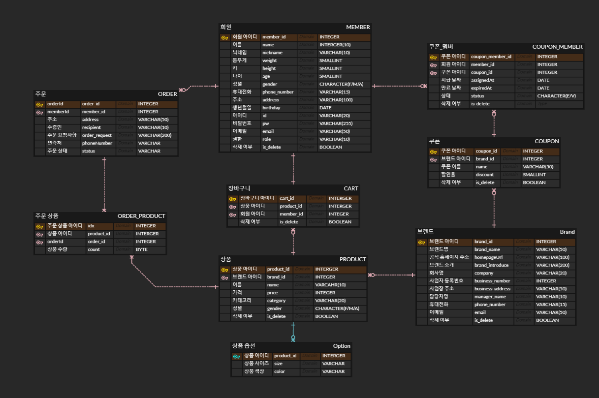

# 💎 Hongsinsa

## 🙋‍♂️ 프로젝트 간단 소개
> [2023년 1월 ~ ing] 무신사 서비스의 MVP 기능을 담은 Hongsinsa server를 개발한 레포지토리입니다 😊

## 🛠 사용된 기술
- 언어 : Kotlin(1.7.22)  
- 컴파일러 : Gradle(7.6)  
- 프레임워크 : Spring Boot(2.7.8)  
- 사용된 기술 : Spring Data JPA, Spring Security, Querydsl, Spring Batch, Spring Scheduler, Slf4j  
- 테스트 기술 : Kotest, Mockk
- 데이터베이스 : H2  
- IDE : Intellij IDEA  

## 🗺 ERD


## 📜 프로젝트 기능
> 회원
- 회원가입
- 로그인
- 프로필 업데이트
- 패스워드 변경
- 보유한 쿠폰 조회

> 쿠폰
- 쿠폰 추가
- 생일 쿠폰 지급(Batch)
- 기간 만료된 쿠폰 처리(Batch)

> 브랜드
- 브랜드 입점
- 브랜드 입점 심사
- 브랜드 업데이트

> 상품
- 상품 등록
- 상품 정보 등록
- 상품 업데이트
- 상품 정보 업데이트
- 상품 품절 업데이트
- 상품 단일 조회
- 상품 전체 태그 조회
- 상품 삭제

> 주문
- 상품 주문
- 주문 조회
- 주문 취소

> 장바구니
- 장바구니 상품 추가
- 장바구니 조회
- 장바구니 상품 삭제

## 📝 Commit Convention
모든 커밋은 간결하게 작성하며 불필요한 커밋은 최소화합니다.

```
ADD : 새로 추가된 File, 작업 등을 의미
UPD : 기존 작업에서 업데이트했다는 의미
CHA : 기존 작업에서 변경했다는 의미
REF : Code Style Format, 로직, 옵션 등을 변경한 것을 의미
DEL : 기존 작업을 삭제했다는 의미
```
